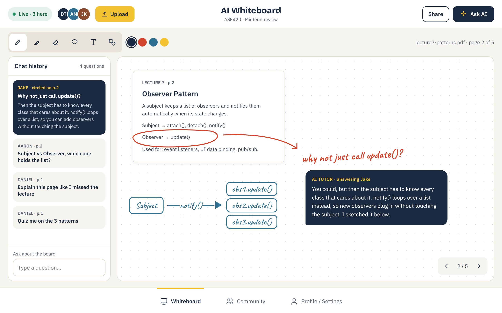
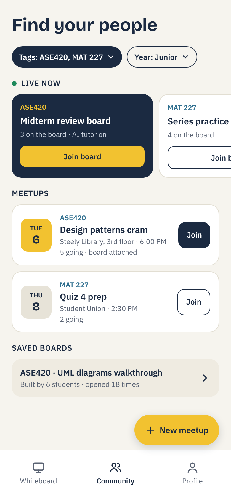

# Norse Whiteboard

An AI whiteboard for NKU students. Upload your notes, slides or PDFs, draw on them with classmates, and ask the AI tutor about anything you circle.

**Live page:** https://thand123.github.io/norse-whiteboard/

## How it works

- **Whiteboard:** Upload a file, mark it up, and hit **Ask AI** (or circle something) to get an explanation right on the board. Every question is saved in the chat history.
- **Community:** Tag boards with your classes (like ASE420). Find live boards to jump into, or set up an in-person meetup (Steely, Student Union) with a board attached.
- **Saved boards:** When a session ends, the board stays on the class page for the next group to study from.

## Mockups

## Original sketches

## Planned stack

- Board: Excalidraw
- Login, file storage, live sync: Supabase
- AI: Gemini (free tier)
